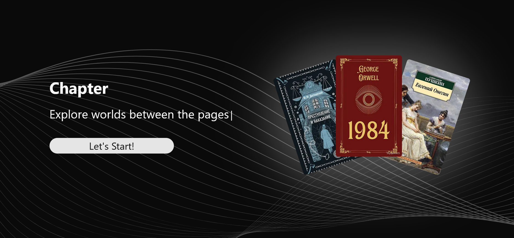
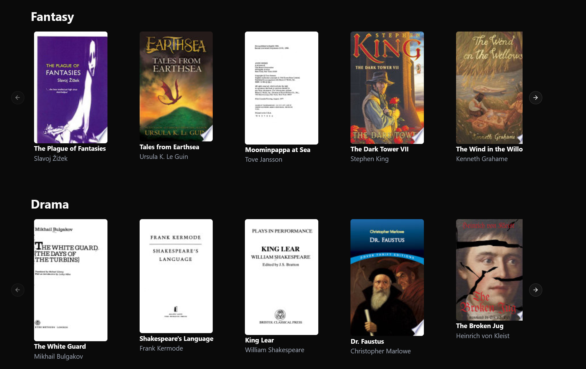
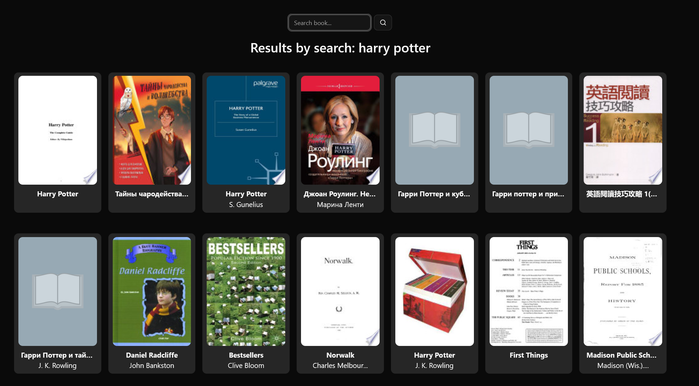
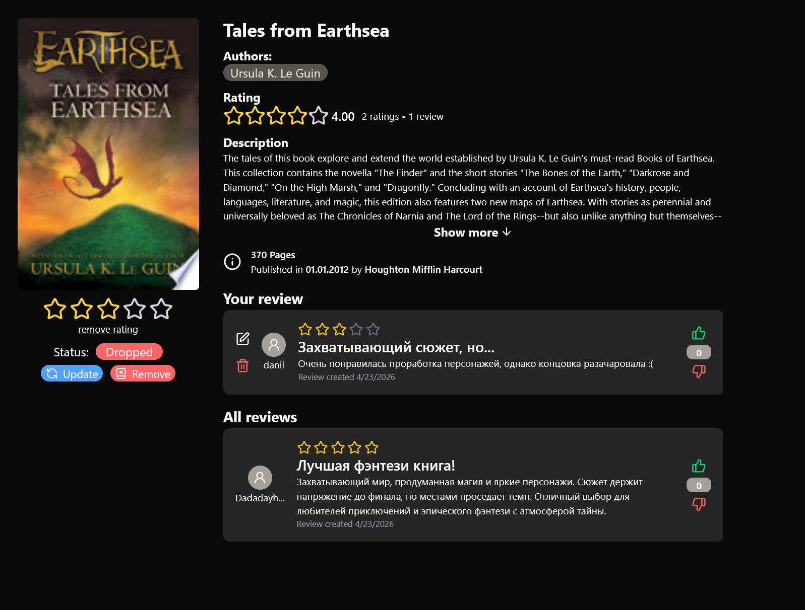
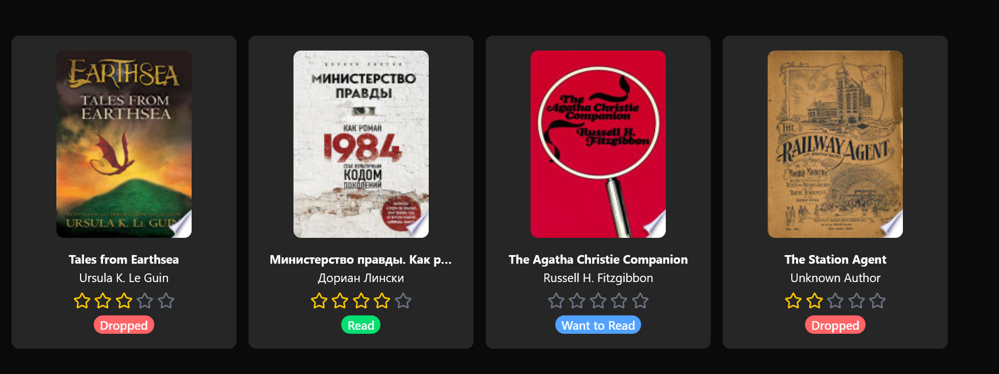
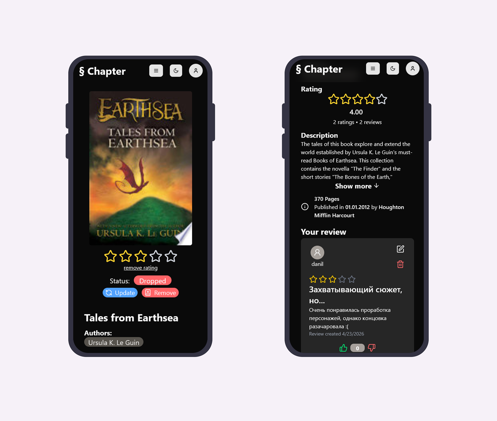
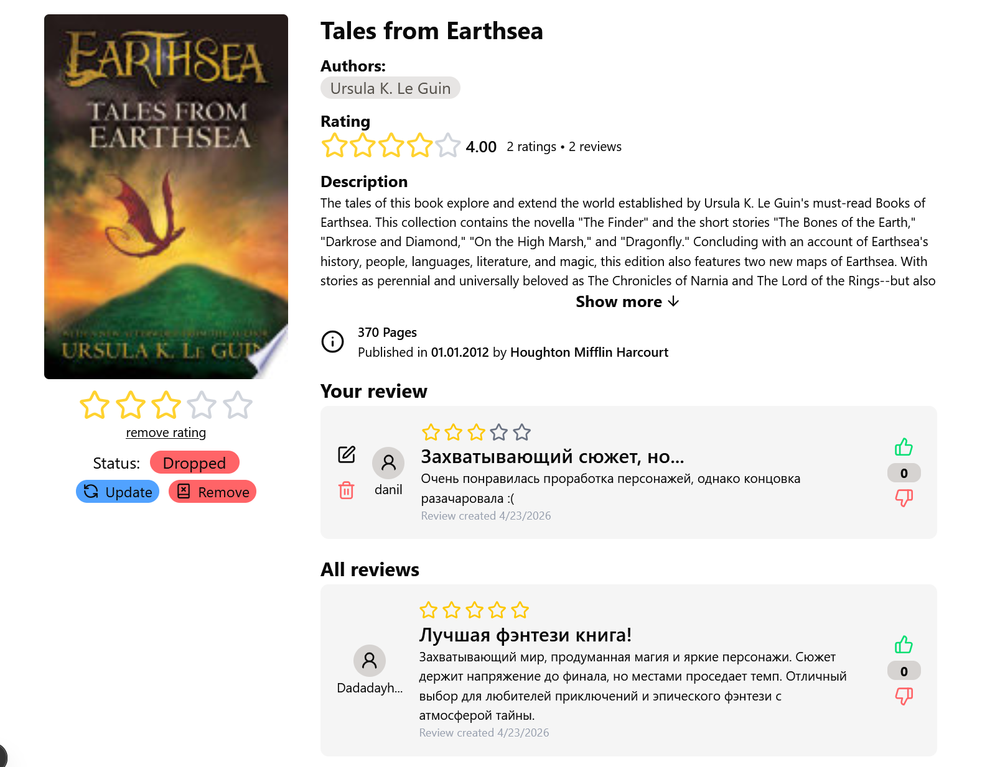
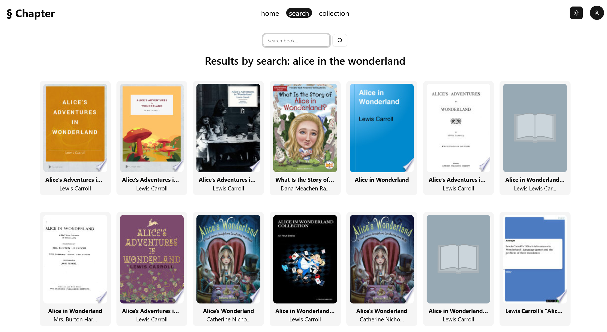

# 📚 Chapter — Платформа управления личной библиотекой


Веб-приложение для создания и управления личной коллекцией книг, с функциями добавления рецензий, оценок и поиска через интеграцию с Google Books API.

> **Работа выполнена в сотрудничестве** с бэкендером. Frontend реализован полностью самостоятельно.

---

## 🎯 Описание проекта

**Chapter** — это современное приложение для книголюбов, которое позволяет:

- 📖 Добавлять книги в личную библиотеку через поиск по Google Books API
- ⭐ Выставлять оценки книгам (1-5 звёзд) и видеть средний рейтинг
- 💬 Писать и читать рецензии других пользователей
- 🔍 Быстро искать книги по названию, автору или году публикации
- 🌙 Поддержка светлой и тёмной темы
- 📱 Адаптивный дизайн (Desktop, Tablet, Mobile)
- 🔐 Аутентификация и защита данных пользователя

---

## 🛠️ Технологический стек

### Frontend

- **Next.js 14** — React фреймворк для SSR и оптимизации
- **TypeScript** — типизированный JavaScript для надёжности
- **TailwindCSS** — утилитарный фреймворк для стилизации
- **shadcn/ui** — готовые UI компоненты
- **React Context API** — управление состоянием (аутентификация)
- **Axios** — HTTP клиент для API запросов
- **Responsive Design** — адаптивная вёрстка

### Backend

- **C# / .NET 10** — современный и производительный стек
- **Entity Framework Core 9** — ORM для работы с БД
- **PostgreSQL** — СУБД для хранения данных
- **JWT Authentication** — безопасная аутентификация
- **ASP.NET Core Identity** — управление пользователями
- **Google Books API** — интеграция поиска книг
- **Swagger/OpenAPI** — документация API

---

## 📸 Скриншоты

### Главная страница и рекомендации




### Поиск книг



### Страница книги с рецензиями, оценками и комментариями



### Личная библиотека



### Мобильная версия



### Светлая тема




---

## 🚀 Запуск проекта

### Требования

- Node.js 18+
- .NET 10 SDK
- PostgreSQL 12+

### Backend

```bash
cd backend

# Создать .env файл
# GoogleBooks__ApiKey={ключ google books api}
# JWT__SigningKey={ключ JWT}
# ConnectionStrings__DefaultConnection="Host={хост};Port={порт};Database={база данных};Username={имя пользователя};Password={пароль};"

# Восстановить зависимости
dotnet restore

# Применить миграции БД
dotnet ef database update

# Запустить в режиме разработки
dotnet run
```

Backend будет доступен на `http://localhost:5000`

### Frontend

```bash
cd frontend

# Установить зависимости
npm install

# Создать .env.local файл
# NEXT_PUBLIC_GOOGLE_BOOKS_API_KEY={ваш ключ google books api}

# Запустить dev сервер
npm run dev
```

Frontend будет доступен на `http://localhost:3000`

---

## 📋 Основной функционал

### Для пользователя

- ✅ Регистрация и вход в аккаунт
- ✅ Поиск книг через Google Books API
- ✅ Добавление/удаление книг из библиотеки
- ✅ Выставление оценок (1-5 звёзд)
- ✅ Написание и редактирование рецензий
- ✅ Просмотр средней оценки и рецензий других пользователей
- ✅ Управление профилем
- ✅ Переключение темы (светлая/тёмная)

### Для разработчика

- ✅ Полностью типизированный TypeScript код
- ✅ REST API с документацией Swagger
- ✅ JWT аутентификация
- ✅ Защищенные роуты
- ✅ Skeleton loading для улучшенного UX при загрузке данных
- ✅ Responsive UI компоненты
- ✅ Clean Code архитектура
- ✅ Database migrations с Entity Framework

---

## 🏗️ Архитектура

### Frontend структура

```
frontend/
├── app/           # Next.js pages и routes
├── components/    # React компоненты
├── context/       # Context API для состояния
├── hooks/         # Custom React hooks
├── lib/           # Утилиты и конфигурация
├── types/         # TypeScript типы
└── public/        # Статические файлы
```

### Backend структура

```
backend/
├── Controllers/   # API endpoints
├── Models/        # Сущности БД
├── Repositories/  # Доступ к данным
├── Services/      # Бизнес-логика
├── Dtos/          # Data Transfer Objects
├── Migrations/    # Миграции БД
└── Data/          # DbContext
```

---

## 👥 Команда

- **Frontend разработчик** — разработка UI/UX, интеграция с API, оптимизация производительности
- **Backend разработчик** — разработка REST API, работа с БД, аутентификация, интеграция Google Books

---

## 📚 API Endpoints

| Метод  | Endpoint                | Описание              |
| ------ | ----------------------- | --------------------- |
| POST   | `/api/auth/register`    | Регистрация           |
| POST   | `/api/auth/login`       | Вход                  |
| GET    | `/api/book/search`      | Поиск книг            |
| GET    | `/api/book/{id}`        | Получить книгу        |
| POST   | `/api/userlibrary`      | Добавить в библиотеку |
| DELETE | `/api/userlibrary/{id}` | Удалить из библиотеки |
| POST   | `/api/rating`           | Добавить оценку       |
| POST   | `/api/review`           | Добавить рецензию     |
| GET    | `/api/review/{bookId}`  | Получить рецензии     |

---

## 🎓 Чему я научился

- Разработка полнофункционального web приложения
- Работа с Next.js и современными React паттернами
- TypeScript для типобезопасности
- REST API интеграция
- Адаптивный дизайн и UX
- Командная разработка и коммуникация
- Deployment и production готовность

---

## 📝 Лицензия

MIT

---

**Проект создан в образовательных целях** | 2025-2026
